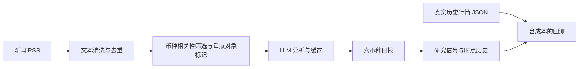

# SocialAlpha

SocialAlpha 是一个开发中的 Python 项目，计划结合社交媒体、新闻和加密货币行情，探索文本清洗、情绪与事件分析、实验性交易信号、回测和可视化。

## 当前实现

- `crawler/reddit_crawler.py`：手动获取 r/Bitcoin 的热门帖子，默认最多 20 条，输出前 5 条。
- 抓取字段包括作者、标题、正文、评分、评论数量、发布时间和链接；当前不抓取评论正文。
- `crawler/news_crawler.py`：采集 CoinDesk 和 Cointelegraph 的 RSS 标题与摘要，不访问文章全文。
- `processor/news_processor.py`：清洗 HTML、过滤无效条目、按规范链接去重、统一 UTC 发布时间，识别 BTC、ETH、SOL、XRP、DOGE、BNB 别名。
- `processor/news_focus.py`：保留六币种相关新闻（包括普通涨跌报道），标记 Strategy/CZ 和重大事件，过滤超出 48 小时时间窗口或无关内容。
- `processor/news_analyzer.py`：使用 LLM 结构化输出新闻情绪、事件类型、币种、摘要、判断依据和主观置信度；通过校验才保存成功结果。
- 新闻 LLM 分析已经完成真实在线调用验证。
- `reporting/daily_report.py`：生成六币种日报，保留事件、证据链接、重点对象动态和数据覆盖；不新增模型调用。
- `signals/sentiment_signal.py`：把情绪指标转换为可用于研究的长仓/现金假设，数据不足时不生成目标仓位。
- `market_data/market_loader.py`：校验真实历史行情 JSON，拒绝重复时点、无时区日期和非法价格。
- `market_data/market_fetcher.py`：通过无需密钥的 Binance 公共接口获取六币种 USDT 现货已完成日线。
- `reporting/market_report.py`：在日报中展示最新已完成日线收盘价格、单日涨跌幅及缺失/过期状态。
- `backtest/sentiment_backtest.py`：独立币种回测引擎，包含费用、滑点、净值与最大回撤，严格按信号可用时间对齐。
- `app/pipeline_run.py`：统一入口。用户画像、机构原始公告/X 采集、网页看板和交易执行尚未接入。

## 框架与统一入口



默认复用已保存的新闻分析，只生成报告与研究信号，不联网、不调用模型：

```powershell
& D:/Anaconda/python.exe "D:/code Python/SocialAlpha/app/pipeline_run.py"
```

需要刷新新闻并分析时显式开启：

```powershell
& D:/Anaconda/python.exe "D:/code Python/SocialAlpha/app/pipeline_run.py" --refresh-news --analyze --limit 5
```

回测接口检查：

```powershell
& D:/Anaconda/python.exe "D:/code Python/SocialAlpha/app/pipeline_run.py" --backtest
```

刷新行情并生成情绪与价格对照日报（不调用 LLM）：

```powershell
& D:/Anaconda/python.exe "D:/code Python/SocialAlpha/app/pipeline_run.py" --refresh-market
```

同时刷新新闻、行情和分析时，使用 `--refresh-news --refresh-market --analyze`。单独行情入口是 `app/market_run.py`。

`config/pipeline_config.json` 统一配置输出路径、报告窗口、研究阈值和回测成本。当前是手动入口，不会创建定时任务。报告窗口默认为最近 24 小时，至少 2 条置信度不低于 0.5 且上下文充分的分析才标为足够覆盖；未知或无新闻不能视为中性结论。情绪分数是文章总体倾向的汇总，多币种文章不代表每个币种有独立的价格方向判断。

输出均位于被 Git 忽略的 `data/`：

| 文件 | 用途 |
| --- | --- |
| `daily_report.md` / `daily_report.json` | 可阅读日报和结构化结果 |
| `signals_latest.json` | 六币种当前研究信号，缺数据时仓位为 null |
| `signals_history.json` | 每次实际生成的带时点信号，用于后续历史验证 |
| `market_daily.json` | 公共接口采集并持续合并的真实收盘行情 |
| `backtest_result.json` | 可选回测结果；没有行情时明确标记 missing_market_data |

行情为 JSON 列表，包含 `symbol`（币种）、`timestamp`（带时区 ISO 周期结束时间）、`close`（有限正数的真实收盘价），采集记录还保留 OHLC、成交量、报价币种、来源和采集时间。配置在 `config/market_config.json`，默认每次获取最近 90 根已完成 UTC 日线，按币种和周期结束时点与历史文件合并。任一币种请求或校验失败则不替换旧文件，不混用其他报价币种。

价格以 USDT 计价，不称为美元实时现价；日报涨跌幅为相邻已完成日线的收盘价变化，不是滚动 24 小时 ticker。缺少两根连续日线时涨跌幅为空，最新收盘超过 36 小时标为过期。Binance 日线 close time 是结束前最后一毫秒，本项目保存加一毫秒后的周期结束时间，未完成日线不会进入回测。接口说明见 [Binance 公共行情文档](https://github.com/binance/binance-spot-api-docs/blob/master/faqs/market_data_only.md)。没有足够历史时点信号时仍不展示收益数字，历史行情不会使今天的情绪变成过去已知的信息。

研究信号使用配置阈值：有效情绪高于正阈值时分配研究仓位，其余有效信号为现金；默认最大单币种研究权重为六分之一，总权重不超过 1。它是待检验的策略假设，没有证明有效，也不连接下单。回测结果是独立币种结果，不是六币种组合绩效。仅在信号 `as_of` 严格早于收盘时才允许用于下一段收益；今天采集和分析的新闻不能倒填到历史日期。当前刚开始积累真实信号，完整历史回测仍需要数据。

## 运行

在项目目录安装依赖并运行：

```powershell
python -m pip install -r requirements.txt
python crawler/reddit_crawler.py
```

抓取代码使用应用级 OAuth（`client_credentials`），需要获批且支持该认证方式的 Reddit 应用。将 `.env.example` 中的三项配置追加到本地 `.env`，保留已有配置，填写真实的 client ID、client secret 和包含本人 Reddit 用户名的 User-Agent。

业务默认值和接口地址位于 `config/reddit_config.json`。脚本缺少配置时会直接报错；401、403 和 429 会分别提示认证、访问权限和限流问题。令牌不写入文件，每次运行重新获取。尚未使用真实凭据验证在线访问，OAuth 接入不保证审批前可以抓取。

## 配置和数据

### 新闻 MVP（无需 Reddit 凭据）

```powershell
& D:/Anaconda/python.exe "D:/code Python/SocialAlpha/app/news_run.py"
```

新闻源、超时、数量、币种别名和输出路径配置在 `config/news_config.json`。默认每个来源读取最多 30 条，手动运行一次后结束，不启动定时采集。结果为项目绝对路径下的 `data/news_clean.json`，每次成功运行替换上次快照；全部来源失败或没有有效新闻时保留旧文件。单个来源失败时记录错误并继续其他来源。

字段为 `id`、`platform`、`source`、`author`、`title`、`content`、`publish_time`、`fetched_at`、`score`、`comments`、`url`、`mention_symbol`。`content` 是 RSS 摘要；新闻没有点赞和评论数，使用 `null`；无法识别币种时返回空列表。去重限于本次快照和相同规范链接，不按相似标题合并不同文章。`fetched_at` 记录采集时间，发布时间不代表该数据在历史回测中已可获得。

此本地 JSON 输出用于个人 MVP，不属于正式交易部标准数据源部署。文件被 Git 忽略，不会上传仓库。

### 新闻情绪与事件分析

在本地 `.env` 追加 `OPENAI_API_KEY` 和 `OPENAI_MODEL`，模型需要支持 Responses API 及严格 JSON Schema 输出。`OPENAI_BASE_URL` 可留空以使用官方接口；其他服务商必须支持这两项能力。仅向模型发送新闻标题、摘要、来源和发布时间，不发送作者信息。现有 Reddit 配置无需修改。

先离线检查，然后小批量调用：

```powershell
& D:/Anaconda/python.exe "D:/code Python/SocialAlpha/app/analyze_news_run.py" --dry-run
& D:/Anaconda/python.exe "D:/code Python/SocialAlpha/app/analyze_news_run.py" --limit 5
```

默认每次最多请求 5 条，当前每日上限已关闭（`daily_max_requests: null`）。可通过 `--limit` 指定本次处理条数；如果以后将每日上限设为正整数，提高 `--limit` 不会绕过每日上限。六币种相关新闻均可进入分析，包括普通涨跌报道；`focus.require_major_event: false` 表示重大事件关键词只作标记，不是入选门槛。所有候选按时间排序，Strategy/CZ 不会挤占普通新闻的处理优先级。规则命中只是候选，不表示事实已核实。新闻涉及 Ripple 公司或 Binance 不一定与 XRP、BNB 直接相关，模型需进一步判断。

重点对象的作用在情绪汇总权重：`config/pipeline_config.json` 的 `report.default_news_weight` 默认为 1，`report.entity_weights` 中 Strategy 和 CZ 均为 1.25。有效评分使用 `Σ(情绪值 × 置信度 × 重要性权重) / Σ(置信度 × 重要性权重)`；同一文章出现多个重点对象只取最大权重，不相乘、不增加样本数。涉及重点对象的媒体报道不等于其本人提出买卖建议。该汇总是新闻情绪分数，不是币价涨跌概率。

参数在 `config/analysis_config.json`：`daily_max_requests` 为每日上限，`max_age_hours` 为新闻时间窗口，`focus` 为重点对象、币种和事件关键词。采集仍使用 CoinDesk/Cointelegraph RSS，不直接采集机构公告或 X；筛选的来源归因为 `media_report`，不能把媒体转述当作本人推荐。

结果写入 `data/news_analysis.json`；`success`、`failed`、`pending`、`filtered` 分别表示成功、失败、未分析和规则过滤。失败条目不填充假结果，每次尝试均消耗请求额度，不自动重试。`data/analysis_usage.json` 保存每日请求次数及接口实际返回的 input/output/total tokens；首次迁移计入旧结果中已记录的调用，用量无法追溯的标为未知，不将其计为零消耗。调用前先预占额度，中断时保守计入次数。账本仅覆盖本项目，不是服务商账户账单，也不能恢复未记录的历史调用。

`data/analysis_cache.json` 保留成功的历史分析缓存，即使新闻暂时从 RSS 快照消失，再次出现仍可复用。缓存按新闻 ID、实际输入、模型、服务地址、提示词及输出结构校验；这些信息变更时会重新分析，仍受每日额度限制。当前版本扩展币种并精简提示词，因此旧版本缓存不会直接匹配。每次请求后保存进度，当前结果文件仅保留当前新闻快照。运行锁阻止并发修改；异常断电可能遗留 `data/analysis.lock`，确认任务已停止后才可移除。勿删除用量账本或缓存来绕过限额。

情绪选项为 `positive/negative/neutral/mixed/unknown`，事件类型为 `regulation/security/adoption/market/macro/technology/other/unknown`。`confidence` 是模型主观确定性，不是涨跌概率；`insufficient_context` 标记摘要信息不足。保留采集时间和实际分析时间，以便后续研究数据可用性。当前结果不能直接作为买卖指令，也尚未进行效果评估。

本地 `.env`、虚拟环境、运行数据和日志不纳入 Git。请勿提交 API 密钥、账户凭据或采集到的原始内容。

LLM 处理、数据保留和作者层面的分析仍需明确设计和允许范围；当前项目不提供实盘交易功能。
